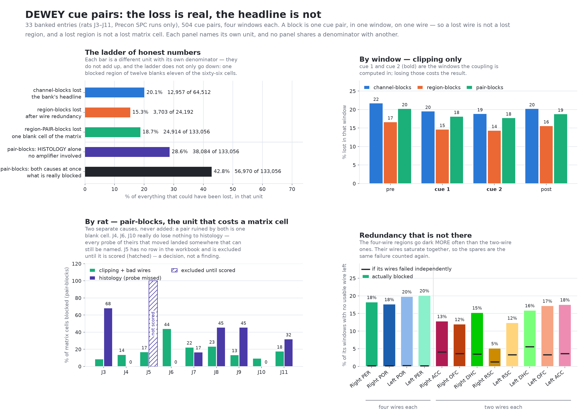

# How much DEWEY data the clipping really cost



## The answer

**Clipping blanks 18.7% of the connectivity matrix — 24,914 region-pair-blocks
of 133,056.** The bank's headline, 12,957, is a count of *channel*-blocks: one
cue pair, one window, one **wire**. It is a true number in a unit nobody can act
on. Redundancy does take the loss down from 20.1% of wires to **15.3% of
regions** — but a blocked region blanks eleven of the sixty-six cells it sits
in, so the number that actually costs you a result comes back *up* to 18.7%.
The ladder does not only go down, and that is the first thing to know.

**Histology costs more than the amplifier ever did: 28.6% of cells, 38,084
pair-blocks, and not one of them has anything to do with clipping.** Put both
causes together and **42.8% of the matrix — 56,970 of 133,056 cells — cannot be
computed at all.** That is the number to plan around.

Of that histology figure, J5 is a decision rather than a finding: it has no row
in the workbook and is excluded until it is scored (decided 2026-09-25). Scored
rats alone lose 25.8%; scoring J5 moves both numbers.

All of it is one experimental phase. Every one of the 33 banked entries is a
**Preconditioning SPC run** (rats J3–J11, sessions 1–4, 504 cue pairs).
Conditioning and test sessions hold no cue pairs, so nothing here speaks for
them.

## What dominates it

- **J6 is the clipping problem.** 43.8% of its cells are blocked by saturation
  alone — twice the next worst (J8 at 23.3%, J7 at 22.3%) and five times J3
  (8.6%) and J10 (9.4%). Fixing one animal's amplifier would move the clipping
  total more than anything else on this list.
- **J3 is the histology problem**, and it is worse: 68.2% of its cells are gone
  because five probes missed (both PORs, both RSCs, Left PER). J8 and J9 lose
  45.5% each, J11 31.8%. J4, J6 and J10 lose nothing to histology — every probe
  of theirs that moved landed somewhere that can still be named.
- **The windows are flat.** `pre` 20.2%, `cue1` 18.1%, `cue2` 17.7%, `post`
  18.8% (pair-blocks, clipping only). The cue windows are the ones the coupling
  is computed in, and they are marginally the *best* of the four. There is no
  window worth salvaging the others for.

## The thing that is probably wrong in your head

**The four-wire regions are not the protected ones. They are the worst ones.**
POR and PER have four wires each; the other eight regions have two. Losing CSC 5
does not lose Left PER, exactly as expected — and Left PER still goes dark in
**20.1%** of its windows, against 5.1% for Right RSC, which has half the wires.
Averaged: 18.9% for the four-wire regions, 13.5% for the two-wire ones.

The reason is in the arithmetic. A single POR/PER wire clips in about 21% of
windows. If those four wires failed independently, the region would go dark in
0.2% of windows. It goes dark in 18–20% — **82 to 113 times more often than
chance**. When one wire of a rhinal region saturates, all four saturate, in the
same window. The spare wires are not four chances at a measurement; they are the
same failure counted four times. Even the two-wire regions run 3–5x above
independence.

So the redundancy in the montage is nominal, and any plan that leans on "we have
four wires there" is leaning on something that is not holding weight.

## Two smaller things worth knowing

- **Every block is on both lists.** `clipped` and `excluded` are identical in all
  12,957 blocks: nobody has hand-removed a channel the amplifier had not already
  ruined. There is no human curation in these numbers yet, so the whole figure is
  a measurement, not a judgement.
- **Bad channels cost nothing here.** The only `bad_channels` in the registry are
  on J3's four recordings, which are 64-channel files with 33–64 marked out. Not
  one of those is a channel any DEWEY region uses, so bad wires eat none of the
  redundancy.

## Confidence

Nothing had to be counted as unknown: all 33 entries carry
`source.parameters.clip_measured = true`, so an empty list means a clean
amplifier rather than nobody having looked. The accounting is
`backend/coupling.py`'s own — `excluded_for`, `channel_sanity`, `blocked_pairs`
— not a second implementation of it. The channel-block total was derived twice
(a raw pass over the JSON, and a pass through `coupling.excluded_for`) and
agrees at 12,957; the pair counts were checked against the identity
`C(12,2) − C(12−blocked,2)` on every event × window, with no disagreements.

**J5 is not scored.** It has no row in the histology workbook, so it is excluded
until it is — every one of its cells is blocked, and its bar on the figure is
hatched rather than solid because that is a decision, not a probe found to have
missed. Its clipping (16.7% of cells) is measured like everyone else's. Adding
its row to `Joes multi site histo results.xlsx` is the whole fix.

## Re-running it

```
python tools\clipping_loss.py
```

Reads the bank and the session registry, prints every number above (and several
the figure has no room for — per-wire, per-region, per-entry), rewrites
`docs/dewey-clipping-loss.png`, and exits non-zero if any cross-check fails.
`--json <path>` also dumps the totals. Bank more recordings and run it again for
a current answer.
