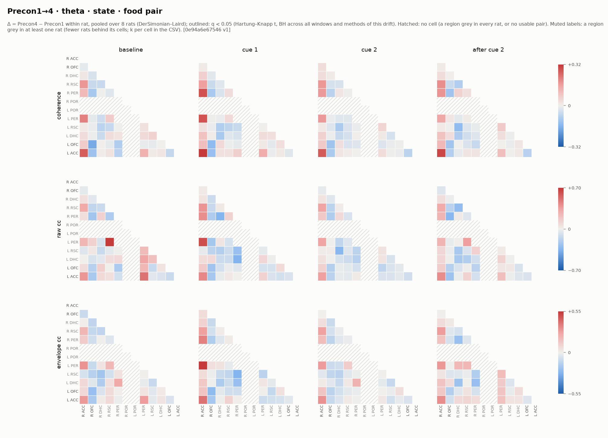
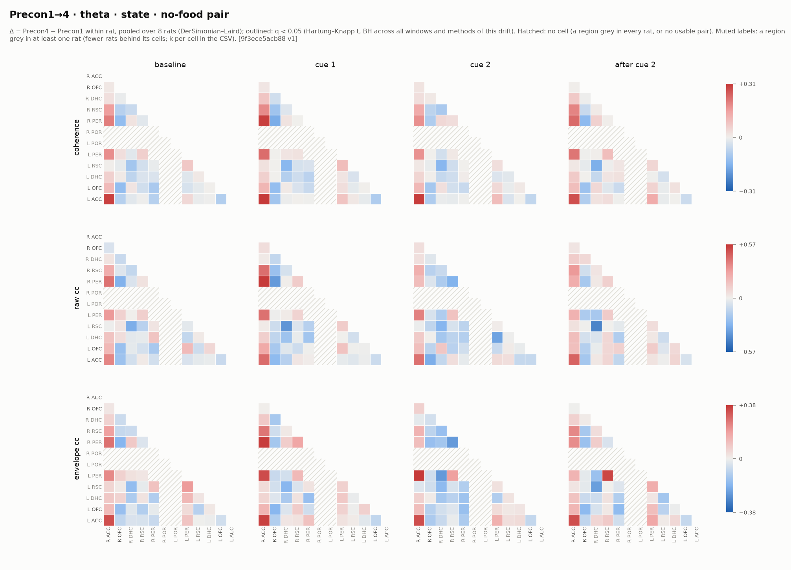
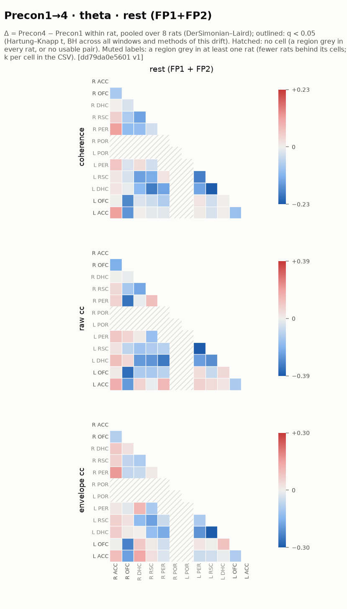
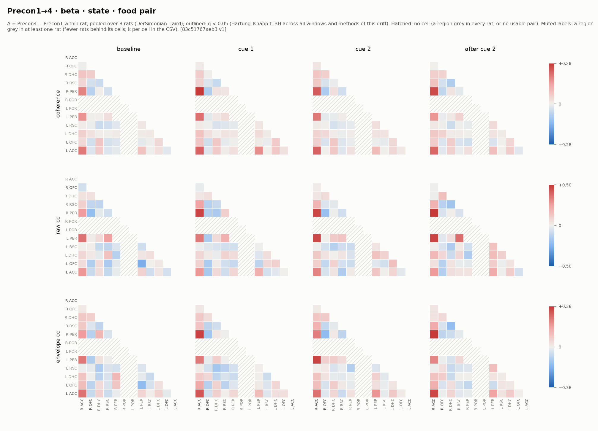
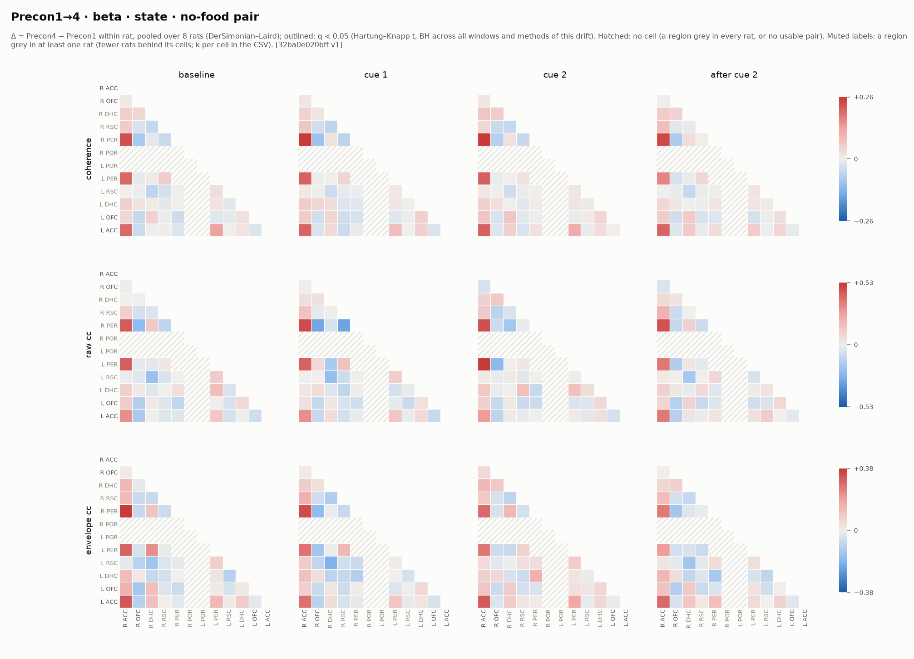
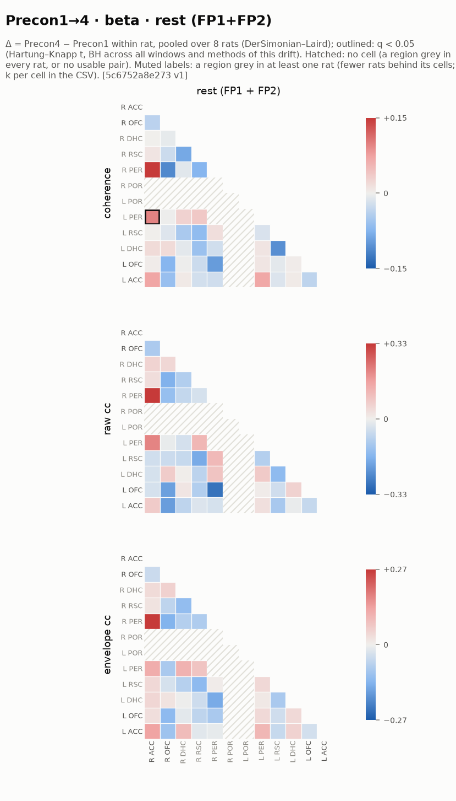
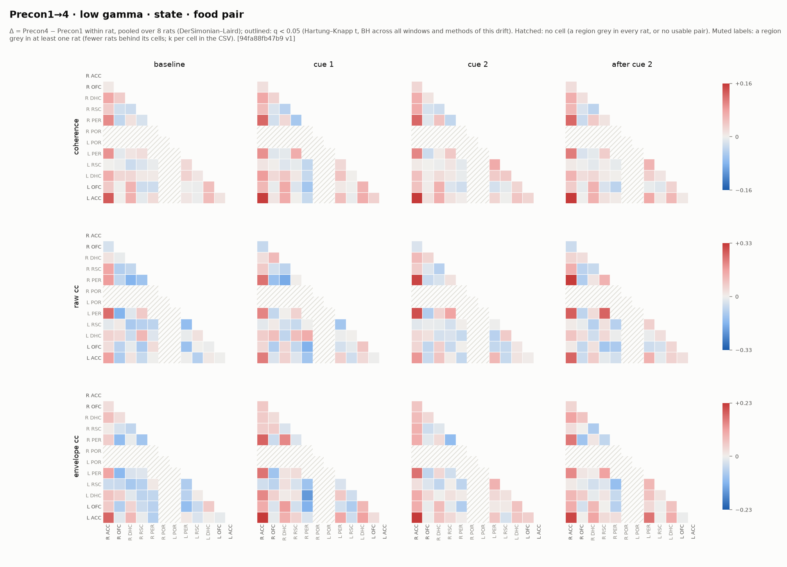
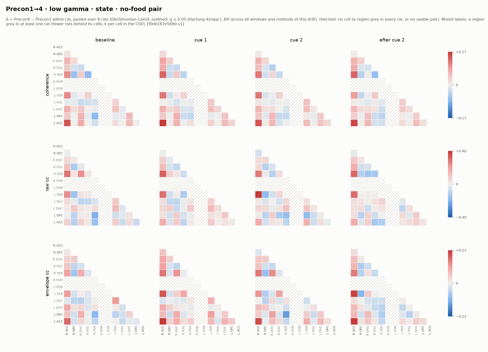
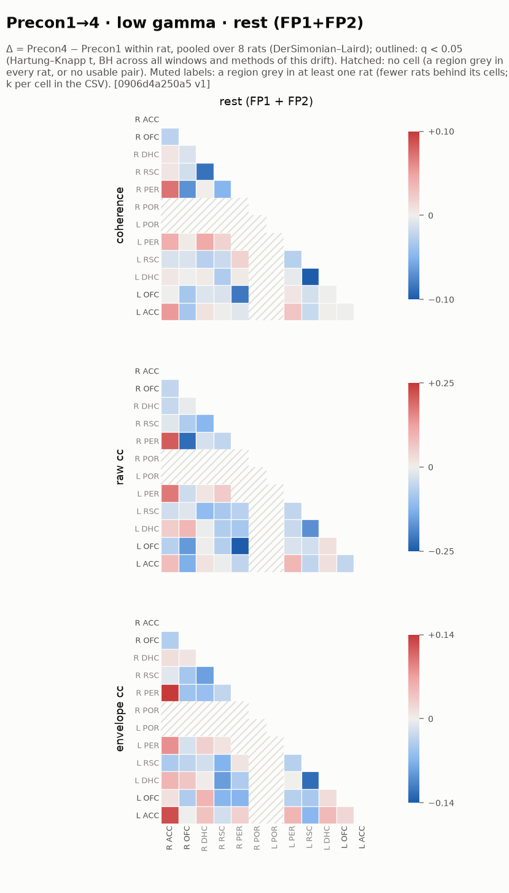
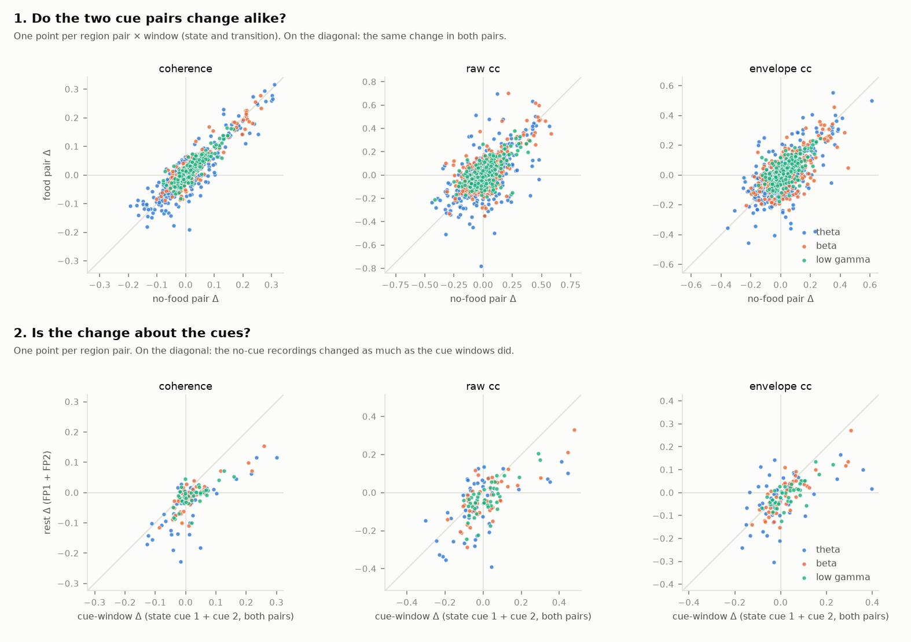

# DEWEY: what changed in coupling from Precon1 to Precon4

**The answer: after correction, no region pair's coupling changed detectably from Precon1 to Precon4** — 0 of 5166 tests in the cue windows (state and transition, both cue pairs, three bands) reach q < 0.05. The closest was beta in transition food pair: Right ACC – Right OFC, cue 2 offset, raw cc: Δ = 0.126 (SE 0.017), t(7) = 7.45, q = 0.053, k = 8 rats [2e430ab5e96d v1].

Within rat, 8 rats (r3, r4, r6, r7, r8, r9, r10, r11), each rat's Precon4 − Precon1 change pooled by DerSimonian–Laird and tested by Hartung–Knapp t on k − 1 df; Benjamini–Hochberg per band across all windows and methods. Every number below names the drift artifact it comes from, as [artifact id vN]; the CSV has every cell.

## What changed, per band and window

Cells reaching q < 0.05, of those tested, per window. *Raw* is the change in the window itself; *cue − baseline* is the change in (window − the same cue pair's baseline), so a change that is only in the baseline, or everywhere alike, drops out.

### theta (4–12 Hz)

| drift | window | q < 0.05 / tested | artifact |
|---|---|---|---|
| state · food pair | baseline | 0 / 123 | [0e94a6e67546 v1] |
|  | cue 1 | 0 / 123 | [0e94a6e67546 v1] |
|  | cue 2 | 0 / 123 | [0e94a6e67546 v1] |
|  | after cue 2 | 0 / 123 | [0e94a6e67546 v1] |
| state · no-food pair | baseline | 0 / 123 | [9f3ece5acb88 v1] |
|  | cue 1 | 0 / 123 | [9f3ece5acb88 v1] |
|  | cue 2 | 0 / 123 | [9f3ece5acb88 v1] |
|  | after cue 2 | 0 / 123 | [9f3ece5acb88 v1] |
| state · food pair · cue − baseline | cue 1 − baseline | 0 / 123 | [7be2b9c1df6b v1] |
|  | cue 2 − baseline | 0 / 123 | [7be2b9c1df6b v1] |
|  | after cue 2 − baseline | 0 / 123 | [7be2b9c1df6b v1] |
| state · no-food pair · cue − baseline | cue 1 − baseline | 0 / 123 | [7c36bd57b4d9 v1] |
|  | cue 2 − baseline | 0 / 123 | [7c36bd57b4d9 v1] |
|  | after cue 2 − baseline | 0 / 123 | [7c36bd57b4d9 v1] |
| transition · food pair | cue 1 onset | 0 / 123 | [078beaf1dab3 v1] |
|  | cue 1 → cue 2 | 0 / 123 | [078beaf1dab3 v1] |
|  | cue 2 offset | 0 / 123 | [078beaf1dab3 v1] |
| transition · no-food pair | cue 1 onset | 0 / 123 | [050dabb58ece v1] |
|  | cue 1 → cue 2 | 0 / 123 | [050dabb58ece v1] |
|  | cue 2 offset | 0 / 123 | [050dabb58ece v1] |
| transition · food pair · cue − baseline | cue 1 onset − baseline | 0 / 123 | [0ef6db2acaae v1] |
|  | cue 1 → cue 2 − baseline | 0 / 123 | [0ef6db2acaae v1] |
|  | cue 2 offset − baseline | 0 / 123 | [0ef6db2acaae v1] |
| transition · no-food pair · cue − baseline | cue 1 onset − baseline | 0 / 123 | [c15adc4826ff v1] |
|  | cue 1 → cue 2 − baseline | 0 / 123 | [c15adc4826ff v1] |
|  | cue 2 offset − baseline | 0 / 123 | [c15adc4826ff v1] |
| rest · no cue | rest (FP1 + FP2) | 0 / 123 | [dd79da0e5601 v1] |

Nothing in theta reaches q < 0.05.

### beta (13–30 Hz)

| drift | window | q < 0.05 / tested | artifact |
|---|---|---|---|
| state · food pair | baseline | 0 / 123 | [83c51767aeb3 v1] |
|  | cue 1 | 0 / 123 | [83c51767aeb3 v1] |
|  | cue 2 | 0 / 123 | [83c51767aeb3 v1] |
|  | after cue 2 | 0 / 123 | [83c51767aeb3 v1] |
| state · no-food pair | baseline | 0 / 123 | [32ba0e020bff v1] |
|  | cue 1 | 0 / 123 | [32ba0e020bff v1] |
|  | cue 2 | 0 / 123 | [32ba0e020bff v1] |
|  | after cue 2 | 0 / 123 | [32ba0e020bff v1] |
| state · food pair · cue − baseline | cue 1 − baseline | 0 / 123 | [93dd69ce5e16 v1] |
|  | cue 2 − baseline | 0 / 123 | [93dd69ce5e16 v1] |
|  | after cue 2 − baseline | 0 / 123 | [93dd69ce5e16 v1] |
| state · no-food pair · cue − baseline | cue 1 − baseline | 0 / 123 | [c71b50aa5e25 v1] |
|  | cue 2 − baseline | 0 / 123 | [c71b50aa5e25 v1] |
|  | after cue 2 − baseline | 0 / 123 | [c71b50aa5e25 v1] |
| transition · food pair | cue 1 onset | 0 / 123 | [2e430ab5e96d v1] |
|  | cue 1 → cue 2 | 0 / 123 | [2e430ab5e96d v1] |
|  | cue 2 offset | 0 / 123 | [2e430ab5e96d v1] |
| transition · no-food pair | cue 1 onset | 0 / 123 | [6a13d331275d v1] |
|  | cue 1 → cue 2 | 0 / 123 | [6a13d331275d v1] |
|  | cue 2 offset | 0 / 123 | [6a13d331275d v1] |
| transition · food pair · cue − baseline | cue 1 onset − baseline | 0 / 123 | [2fe5e573a069 v1] |
|  | cue 1 → cue 2 − baseline | 0 / 123 | [2fe5e573a069 v1] |
|  | cue 2 offset − baseline | 0 / 123 | [2fe5e573a069 v1] |
| transition · no-food pair · cue − baseline | cue 1 onset − baseline | 0 / 123 | [9bdfd3dd6a2d v1] |
|  | cue 1 → cue 2 − baseline | 0 / 123 | [9bdfd3dd6a2d v1] |
|  | cue 2 offset − baseline | 0 / 123 | [9bdfd3dd6a2d v1] |
| rest · no cue | rest (FP1 + FP2) | 1 / 123 | [5c6752a8e273 v1] |

- **rest · rest** [5c6752a8e273 v1]:
  - Right ACC – Left PER, rest (FP1 + FP2), coherence: Δ = 0.100 (SE 3.8e-06), t(1) = 26486.96, q = 0.003, k = 2 rats — FRAGILE: 2 rats, so the SE is how closely they happen to agree (Hartung–Knapp factor 2.6e-08)

### low gamma (30–55 Hz)

| drift | window | q < 0.05 / tested | artifact |
|---|---|---|---|
| state · food pair | baseline | 0 / 123 | [94fa88fb47b9 v1] |
|  | cue 1 | 0 / 123 | [94fa88fb47b9 v1] |
|  | cue 2 | 0 / 123 | [94fa88fb47b9 v1] |
|  | after cue 2 | 0 / 123 | [94fa88fb47b9 v1] |
| state · no-food pair | baseline | 0 / 123 | [f0db187e569d v1] |
|  | cue 1 | 0 / 123 | [f0db187e569d v1] |
|  | cue 2 | 0 / 123 | [f0db187e569d v1] |
|  | after cue 2 | 0 / 123 | [f0db187e569d v1] |
| state · food pair · cue − baseline | cue 1 − baseline | 0 / 123 | [a5480c3e2c88 v1] |
|  | cue 2 − baseline | 0 / 123 | [a5480c3e2c88 v1] |
|  | after cue 2 − baseline | 0 / 123 | [a5480c3e2c88 v1] |
| state · no-food pair · cue − baseline | cue 1 − baseline | 0 / 123 | [61760b00dc3d v1] |
|  | cue 2 − baseline | 0 / 123 | [61760b00dc3d v1] |
|  | after cue 2 − baseline | 0 / 123 | [61760b00dc3d v1] |
| transition · food pair | cue 1 onset | 0 / 123 | [3becbb099aaf v1] |
|  | cue 1 → cue 2 | 0 / 123 | [3becbb099aaf v1] |
|  | cue 2 offset | 0 / 123 | [3becbb099aaf v1] |
| transition · no-food pair | cue 1 onset | 0 / 123 | [817258e25b12 v1] |
|  | cue 1 → cue 2 | 0 / 123 | [817258e25b12 v1] |
|  | cue 2 offset | 0 / 123 | [817258e25b12 v1] |
| transition · food pair · cue − baseline | cue 1 onset − baseline | 0 / 123 | [d05449e2cacd v1] |
|  | cue 1 → cue 2 − baseline | 0 / 123 | [d05449e2cacd v1] |
|  | cue 2 offset − baseline | 1 / 123 | [d05449e2cacd v1] |
| transition · no-food pair · cue − baseline | cue 1 onset − baseline | 0 / 123 | [dd8beb78f5a0 v1] |
|  | cue 1 → cue 2 − baseline | 0 / 123 | [dd8beb78f5a0 v1] |
|  | cue 2 offset − baseline | 0 / 123 | [dd8beb78f5a0 v1] |
| rest · no cue | rest (FP1 + FP2) | 0 / 123 | [0906d4a250a5 v1] |

- **transition · food pair · cue − baseline** [d05449e2cacd v1]:
  - Right ACC – Left OFC, cue 2 offset − baseline, envelope cc: Δ = 0.153 (SE 0.020), t(7) = 7.70, q = 0.043, k = 8 rats

## Two sanity checks

**1. Do the two cue pairs agree?** Nothing about Precon1 → Precon4 should depend on which pair will later be fed — the rats have not been conditioned yet. The food − no-food contrast tests, per rat, the food pair's change minus the no-food pair's change:

- theta: state 0 of 492 at q < 0.05 [e82ffb979c3a v1]; transition 1 of 369 at q < 0.05 [a1da8c7f6e99 v1]; across cells the two pairs' changes (Δ) correlate r = 0.88 / 0.57 / 0.62 (coherence / raw cc / envelope cc; n = 308/308/308 cells), from the raw drifts [0e94a6e67546 v1] [9f3ece5acb88 v1] [078beaf1dab3 v1] [050dabb58ece v1]
- beta: state 0 of 492 at q < 0.05 [58f82c840272 v1]; transition 0 of 369 at q < 0.05 [5bb7cbb7dd13 v1]; across cells the two pairs' changes (Δ) correlate r = 0.93 / 0.70 / 0.69 (coherence / raw cc / envelope cc; n = 308/308/308 cells), from the raw drifts [83c51767aeb3 v1] [32ba0e020bff v1] [2e430ab5e96d v1] [6a13d331275d v1]
- low gamma: state 0 of 492 at q < 0.05 [069f857e4fce v1]; transition 0 of 369 at q < 0.05 [bbbd64f3e49a v1]; across cells the two pairs' changes (Δ) correlate r = 0.89 / 0.60 / 0.66 (coherence / raw cc / envelope cc; n = 308/308/308 cells), from the raw drifts [94fa88fb47b9 v1] [f0db187e569d v1] [3becbb099aaf v1] [817258e25b12 v1]

**2. Is the change about the cues?** The FP1 + FP2 recordings of the same days hold no cues. A change that shows up there as strongly as in the cue windows is a change in the rat or the electrodes across days, not in how the cues are processed:

- theta: rest 0 of 123 at q < 0.05 [dd79da0e5601 v1]; the rest change (Δ) against the cue windows' change [0e94a6e67546 v1] [9f3ece5acb88 v1] correlates r = 0.71 / 0.55 / 0.45 (coherence / raw cc / envelope cc; n = 44/44/44 cells)
- beta: rest 1 of 123 at q < 0.05 [5c6752a8e273 v1]; the rest change (Δ) against the cue windows' change [83c51767aeb3 v1] [32ba0e020bff v1] correlates r = 0.83 / 0.75 / 0.82 (coherence / raw cc / envelope cc; n = 44/44/44 cells)
- low gamma: rest 0 of 123 at q < 0.05 [0906d4a250a5 v1]; the rest change (Δ) against the cue windows' change [94fa88fb47b9 v1] [f0db187e569d v1] correlates r = 0.63 / 0.73 / 0.76 (coherence / raw cc / envelope cc; n = 44/44/44 cells)

## Which regions it can speak to

A region is computed in a rat only where histology puts the probe where it was aimed (a relocated, missed or unscored probe is grey — not computed). Rats in which each region is usable, counted from the drifts' own grey lists:

| region | usable in | left | right |
|---|---|---|---|
| ACC | 8 of 8 | 8/8 | 8/8 |
| OFC | 8 of 8 | 8/8 | 8/8 |
| RSC | 6–7 of 8 | 7/8 | 6/8 |
| DHC | 5–6 of 8 | 6/8 | 5/8 |
| PER | 2 of 8 | 2/8 | 2/8 |
| POR | 0 of 8 | 0/8 | 0/8 |

So the result is about the regions usable in most rats; a pair involving a region usable in few rats has a small k (in the CSV) and Hartung–Knapp needs k ≥ 2 to test at all.

## How it was made

- Rats r3, r4, r6, r7, r8, r9, r10, r11; r5 left out: no Precon4 recording, and no histology row. Precon1 and Precon4 SPC recordings, re-banked with the transition check (1.0 s before, 2.0 s after each boundary).
- Cue roles from each rat's own conditioning (Con SPC TTLs, backend/cueroles.py): the pair whose second cue is followed by a Pellet Delivery within 15 s is the food pair. r3 Click_LowTone; r4 HighTone_Noise; r6 Noise_HighTone; r7 Noise_LowTone; r8 Click_HighTone; r9 HighTone_Click; r10 LowTone_Noise; r11 LowTone_Click.
- Bands: theta 4–12 Hz (lag ±500 ms), beta 13–30 Hz (±150 ms), low gamma 30–55 Hz (±60 ms); coherence averaged over the band; cross-correlation on band-passed signals.
- Windows: state (baseline, cue 1, cue 2, after cue 2; 10 s each), transition (cue 1 onset, cue 1 → cue 2, cue 2 offset; 1 s before to 2 s after), rest (10 s epochs over FP1 + FP2, as many as the day's cue pairs).
- A cell's k is the number of rats that contribute; n the cue pairs (or epochs) behind it.

### The drift artifacts

| drift | artifact | version | version id | digest | cells | tested | q < 0.05 |
|---|---|---|---|---|---|---|---|
| Precon1→4 · theta · state · food pair | 0e94a6e67546 | v1 | 406962c66542 | 01167b197c9e | 528 | 492 | 0 |
| Precon1→4 · theta · state · no-food pair | 9f3ece5acb88 | v1 | dc2a98fc091b | 572ad14072e4 | 528 | 492 | 0 |
| Precon1→4 · theta · state · food pair · cue − baseline | 7be2b9c1df6b | v1 | 0a389e846a26 | 64dac171da45 | 396 | 369 | 0 |
| Precon1→4 · theta · state · no-food pair · cue − baseline | 7c36bd57b4d9 | v1 | 1f09df0a3dec | 7fb0b6cb4b07 | 396 | 369 | 0 |
| Precon1→4 · theta · state · food − no-food (sanity) | e82ffb979c3a | v1 | 13c020066e34 | bcaf0206ed39 | 528 | 492 | 0 |
| Precon1→4 · theta · transition · food pair | 078beaf1dab3 | v1 | e2445a653803 | d30678aa74e2 | 396 | 369 | 0 |
| Precon1→4 · theta · transition · no-food pair | 050dabb58ece | v1 | 751b20d314e2 | 07385a9f11d3 | 396 | 369 | 0 |
| Precon1→4 · theta · transition · food pair · cue − baseline | 0ef6db2acaae | v1 | 93bc89ee2d46 | eddab2c16d8b | 396 | 369 | 0 |
| Precon1→4 · theta · transition · no-food pair · cue − baseline | c15adc4826ff | v1 | 8136703ac09f | 92656de184aa | 396 | 369 | 0 |
| Precon1→4 · theta · transition · food − no-food (sanity) | a1da8c7f6e99 | v1 | b89e51db7057 | 0e35b7ef5cff | 396 | 369 | 1 |
| Precon1→4 · theta · rest (FP1+FP2) | dd79da0e5601 | v1 | b50a6e7d7ad3 | f961535dd455 | 132 | 123 | 0 |
| Precon1→4 · beta · state · food pair | 83c51767aeb3 | v1 | 456a83fc979c | 387df52b0577 | 528 | 492 | 0 |
| Precon1→4 · beta · state · no-food pair | 32ba0e020bff | v1 | d2603fc1c85f | 51c1d9148044 | 528 | 492 | 0 |
| Precon1→4 · beta · state · food pair · cue − baseline | 93dd69ce5e16 | v1 | 8faf42de4c4e | cd6ab9ed676f | 396 | 369 | 0 |
| Precon1→4 · beta · state · no-food pair · cue − baseline | c71b50aa5e25 | v1 | c6cc8a275b82 | 24b72019ce6f | 396 | 369 | 0 |
| Precon1→4 · beta · state · food − no-food (sanity) | 58f82c840272 | v1 | f74ba1e9f0a5 | b49ff4da5656 | 528 | 492 | 0 |
| Precon1→4 · beta · transition · food pair | 2e430ab5e96d | v1 | 375e809d05c4 | a18a86b6e37c | 396 | 369 | 0 |
| Precon1→4 · beta · transition · no-food pair | 6a13d331275d | v1 | 11813eba5781 | 09b8bf1088f0 | 396 | 369 | 0 |
| Precon1→4 · beta · transition · food pair · cue − baseline | 2fe5e573a069 | v1 | b02f15b78c0b | 0b68cccd2df5 | 396 | 369 | 0 |
| Precon1→4 · beta · transition · no-food pair · cue − baseline | 9bdfd3dd6a2d | v1 | 0754399c402a | 0e063891f062 | 396 | 369 | 0 |
| Precon1→4 · beta · transition · food − no-food (sanity) | 5bb7cbb7dd13 | v1 | 5e7b7451e94f | 2938efa9aaf1 | 396 | 369 | 0 |
| Precon1→4 · beta · rest (FP1+FP2) | 5c6752a8e273 | v1 | f726fd4a382d | a5f86542440e | 132 | 123 | 1 |
| Precon1→4 · low gamma · state · food pair | 94fa88fb47b9 | v1 | cfca6c433ed2 | 529c1966d1f0 | 528 | 492 | 0 |
| Precon1→4 · low gamma · state · no-food pair | f0db187e569d | v1 | 41de219ddf6e | 5bc6003b992e | 528 | 492 | 0 |
| Precon1→4 · low gamma · state · food pair · cue − baseline | a5480c3e2c88 | v1 | 742b3838f73a | 3441aaf1fe28 | 396 | 369 | 0 |
| Precon1→4 · low gamma · state · no-food pair · cue − baseline | 61760b00dc3d | v1 | 8571a6c7ce3c | cbc9b09f1dfb | 396 | 369 | 0 |
| Precon1→4 · low gamma · state · food − no-food (sanity) | 069f857e4fce | v1 | 07113246f727 | 3592045ff4b5 | 528 | 492 | 0 |
| Precon1→4 · low gamma · transition · food pair | 3becbb099aaf | v1 | 75d76d2d4f69 | 73ac19c04a3d | 396 | 369 | 0 |
| Precon1→4 · low gamma · transition · no-food pair | 817258e25b12 | v1 | 9854a4c677cb | 0899559190c6 | 396 | 369 | 0 |
| Precon1→4 · low gamma · transition · food pair · cue − baseline | d05449e2cacd | v1 | dd54427528ea | d74b8a0ad5db | 396 | 369 | 1 |
| Precon1→4 · low gamma · transition · no-food pair · cue − baseline | dd8beb78f5a0 | v1 | c54830d87f53 | 75efb4c06576 | 396 | 369 | 0 |
| Precon1→4 · low gamma · transition · food − no-food (sanity) | bbbd64f3e49a | v1 | 3754a51973ff | 2b6987f15f2f | 396 | 369 | 0 |
| Precon1→4 · low gamma · rest (FP1+FP2) | 0906d4a250a5 | v1 | 03128fec5e2c | 1825ecf9832d | 132 | 123 | 0 |

CSV: `dewey-precon-drift.csv` — 13464 rows, one per drift cell (columns: band, kind, pair role, contrast, window, method, region pair, delta, se, t, df, p, q, k, n, artifact_id, version).

Other figures: [Precon1→4 · theta · state · food pair · cue − baseline](dewey-precon-drift/theta-state-food-minus-baseline.png), [Precon1→4 · theta · state · no-food pair · cue − baseline](dewey-precon-drift/theta-state-nofood-minus-baseline.png), [Precon1→4 · theta · state · food − no-food (sanity)](dewey-precon-drift/theta-state-food-minus-nofood.png), [Precon1→4 · theta · transition · food pair](dewey-precon-drift/theta-transition-food.png), [Precon1→4 · theta · transition · no-food pair](dewey-precon-drift/theta-transition-nofood.png), [Precon1→4 · theta · transition · food pair · cue − baseline](dewey-precon-drift/theta-transition-food-minus-baseline.png), [Precon1→4 · theta · transition · no-food pair · cue − baseline](dewey-precon-drift/theta-transition-nofood-minus-baseline.png), [Precon1→4 · theta · transition · food − no-food (sanity)](dewey-precon-drift/theta-transition-food-minus-nofood.png), [Precon1→4 · beta · state · food pair · cue − baseline](dewey-precon-drift/beta-state-food-minus-baseline.png), [Precon1→4 · beta · state · no-food pair · cue − baseline](dewey-precon-drift/beta-state-nofood-minus-baseline.png), [Precon1→4 · beta · state · food − no-food (sanity)](dewey-precon-drift/beta-state-food-minus-nofood.png), [Precon1→4 · beta · transition · food pair](dewey-precon-drift/beta-transition-food.png), [Precon1→4 · beta · transition · no-food pair](dewey-precon-drift/beta-transition-nofood.png), [Precon1→4 · beta · transition · food pair · cue − baseline](dewey-precon-drift/beta-transition-food-minus-baseline.png), [Precon1→4 · beta · transition · no-food pair · cue − baseline](dewey-precon-drift/beta-transition-nofood-minus-baseline.png), [Precon1→4 · beta · transition · food − no-food (sanity)](dewey-precon-drift/beta-transition-food-minus-nofood.png), [Precon1→4 · low gamma · state · food pair · cue − baseline](dewey-precon-drift/gamma-low-state-food-minus-baseline.png), [Precon1→4 · low gamma · state · no-food pair · cue − baseline](dewey-precon-drift/gamma-low-state-nofood-minus-baseline.png), [Precon1→4 · low gamma · state · food − no-food (sanity)](dewey-precon-drift/gamma-low-state-food-minus-nofood.png), [Precon1→4 · low gamma · transition · food pair](dewey-precon-drift/gamma-low-transition-food.png), [Precon1→4 · low gamma · transition · no-food pair](dewey-precon-drift/gamma-low-transition-nofood.png), [Precon1→4 · low gamma · transition · food pair · cue − baseline](dewey-precon-drift/gamma-low-transition-food-minus-baseline.png), [Precon1→4 · low gamma · transition · no-food pair · cue − baseline](dewey-precon-drift/gamma-low-transition-nofood-minus-baseline.png), [Precon1→4 · low gamma · transition · food − no-food (sanity)](dewey-precon-drift/gamma-low-transition-food-minus-nofood.png).
